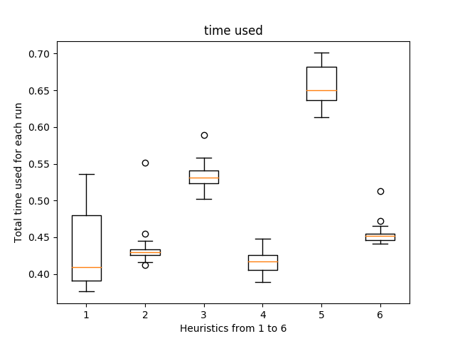

\clearpage

# Description of the Strategy 

## General Description of the Searching Algorithm

To search for closed knight's tour, iterative depth-first search algorithm 
(DFS) is implemented. However, the memory and time requirement of DFS is very 
huge. Several heuristic algorithms are applied to optimize the searching 
process.

Staring from the root node ($(2,3)$ in this homework), iterative DFS algorithm 
pushes all its neighbors into a stack according to a specific order determined 
by different heuristics. Then, it iteratively `peek()` the top element in the 
stack, add it to our current path and push all its valid neighbors into the 
stack. Once we reach a stage where the current node does not have any valid 
neighbors and closed knight's tour has not been found, we start backtracking. 
To backtrack from the current node, `remove()` this node from the path, `pop()` 
it from the top of the stack and start next iteration by peeking the top of the 
stack. If the next element on top of the stack is the same as the last element 
in the path, we should directly `pop()` this node from stack and `remove()` 
from the path because all its neighbors have been explored and no closed 
knight's tour has been found. This process is executed iterative until the 
stack is clear.

## Sorting of Different Strategy {#sec:cmpstgy}

The general framework of finding closed Knights' tour has been briefly 
described above. One of the most important steps in the above algorithm is the 
ordering of neighbor nodes in stack. Several heuristics has been given in the 
task sheet. They are briefly described below. 

0. Order neighbors of the current node (the last one in path) randomly. (Blind 
   search is performed)
1. Order the neighbors according to their fixed degree. \
   This strategy favors nodes living near the edges and corners then nodes in 
   the center of the board.
2. Order the neighbors according to their dynamic degree. \
   This strategy firstly visits nodes with less degrees. In this way, the 
   possibility of reaching a dead end is minimized. 
3. Backup when more than one neighbor of the current node has dynamic degree 
   $1$. \
   If there are two neighbors having dynamic degree $1$ and one of them is 
   added to path, then Knight has to visit the other neighbor to form a closed 
   tour eventually. But it will reach a dead end because the dynamic degree of 
   the node will be $0$. Applying this strategy can avoid lots of dead ends and 
   thus enhance the efficiency and effectiveness of the searching process.
4. Prioritize neighbor with dynamic degree $1$ and discard its siblings. \
   This is because paths containing its siblings rather then the $1$ degree 
   neighbor will reach a dead end in the end. Suppose the algorithm chooses a 
   neighbor with dynamic degree larger than $1$. The path has to reach the $1$ 
   degree node in order to form a tour. But once this node is added to path, a 
   dead end is reached. This strategy can also avoid lots of dead ends and thus 
   will yield many correct results. 
5. Combine $2,3,4$. \
   When strategy $3$ and $4$ are combined, they will improve the searching 
   together rather than fighting with each other because this two heuristics 
   are applied to two different situations.

## An Extra Strategy 6

After doing many experiments, choosing to visit nodes lying along the edges and 
at corners first seems to be a very good strategy because the alternative, 
visiting nodes in the center of the board first, tends to isolate those nodes 
at corner. Those nodes are very hard to be accessed (especially when most of 
the nodes at center are visited). Based on this idea, we can favor those 
neighbors at corners when they have the same dynamic degree (in strategy $2$). 
To characterize this, we can measure the manhattan distance between the 
candidate neighbors and the four corners and choose the one with the smallest 
distance to any of the four corners.

# Experiment Summary

## Statistics of each strategy

<!--
{#fig:numbox width=80%}

{#fig:numline width=80%}

\clearpage

{width=80%}

{width=80%}

\clearpage

{width=80%}

{width=80%}

\clearpage

{width=80%}

{width=80%}
-->

{#fig:numbox width=50%}
{#fig:numline width=50%}

Statistics of number of solutions found

From the Figure (\ref{fig:numofsols}), we can see that the number of closed 
tour solutions given by strategy $0$ to $5$ increases slowly at first and then 
boosts later. This kind of behavior has not surprised me. Strategy $0$ which 
applies blind search strategy almost cannot find a single closed Knights' Tour. 
All the informed search (from strategy $1$ to strategy $5$) are better than 
strategy $0$ because all of the heuristics are effective. Strategy $1$ which 
only relies on the fixed degree gets less results on average compared to 
strategy $3,4,5$ because it cannot avoid dead ends as strategy $3,4,5$ do. The 
detailed analysis of each strategy is given in section \ref{sec:cmpstgy}. 

{width=50%}
{width=50%}

Statistics of time used for each run

From figure (\ref{fig:timeused}), we can see that strategy $5$ are the 
slowest.The reason of this is combining strategy $2$ to $4$ requires more time 
to query and update the dynamic degree of the neighbors. To the contrary, 
methods based on fix degree generally requires less time to run because getting 
the fix degree of a neighbor in graph only needs constant time.

{width=50%}
{width=50%}

Statistics of moves per second for each run

From figure (\ref{fig:movpersec}), we can see that by running $1000,000$ states 
in total, strategy $1$ has the highest number of moves in one second. This is 
reasonable in the sense that strategy add nodes to path without too much 
thoughts compared to strategy $5$. The smaller the number of moves are made in 
one second, the larger the number of backtracks are made. This explains why 
strategy $3$ and $5$ move less (because when multiple neighbors having dynamic 
degree $1$ are detected, they start to backtrack). Strategy $4$ which 
directly discard siblings of neighbors with dynamic degree $1$ does not need to 
do many backtracks and therefore moves a lot in each second. But those moves 
are "smarter" compared to strategy $1$ because they can help to avoid lots of 
dead ends. (details are explained in section \ref{sec:cmpstgy})

{width=50%}
{width=50%}

Statistics of solutions per second for each run

Figure (\ref{fig:solspersec}) records the statistics of the number of solutions 
of each heuristics get per second. Not surprisingly, strategy $5$ can give the 
most solutions per second because it can effectively avoid many dead end path 
and increase the searching efficiency. 
